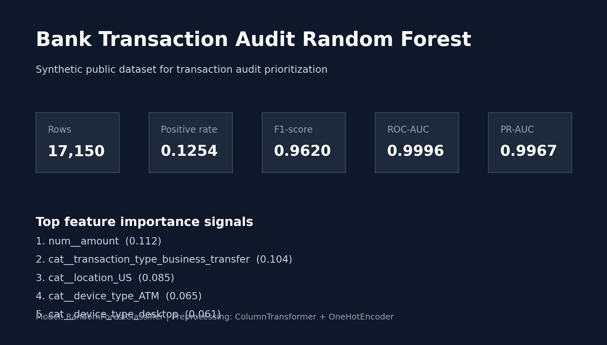
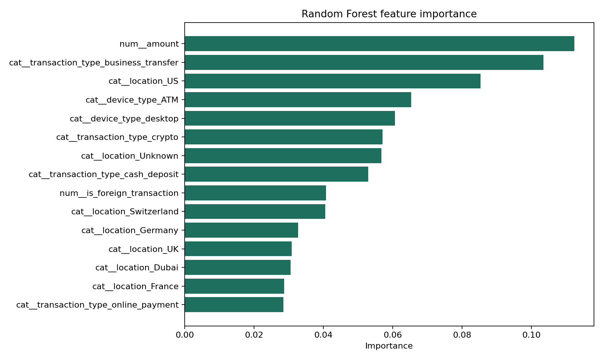

# Bank Transaction Audit Random Forest

## PT-BR

Projeto de `machine learning` com `RandomForestClassifier` para priorização de auditoria de transações bancárias fictícias, usando um dataset público sintético com múltiplas variáveis numéricas e categóricas.

O objetivo do case é mostrar como um modelo de ensemble baseado em árvores pode apoiar times de risco, compliance e auditoria interna na identificação de transações com maior probabilidade de anomalia ou fraude.

## Resultado atual

- `Rows`: `17.150`
- `Train size`: `13.720`
- `Test size`: `3.430`
- `Positive rate`: `0.1254`
- `F1-score`: `0.9620`
- `ROC-AUC`: `0.9996`
- `PR-AUC`: `0.9967`

Leitura prática:

- o modelo separa muito bem as transações positivas e negativas nesse dataset;
- a performance alta é coerente com a natureza sintética da base;
- o case é ótimo para explicar pipeline tabular, `Random Forest` e `feature importance`, mas não deve ser interpretado como benchmark de produção real sem validação adicional.

Resumo visual dos resultados:



## Fonte pública dos dados

Dataset utilizado:

- [h0d4r1/fraud_dataset](https://huggingface.co/datasets/h0d4r1/fraud_dataset)

Características do dataset:

- `17.150` transações
- `10` colunas originais
- alvo binário em `risk_score`
- dados sintéticos e fictícios, adequados para portfólio e demonstração

## Objetivo do projeto

Construir um pipeline supervisionado para classificar transações suspeitas em um cenário de auditoria bancária, com foco em:

- preprocessamento de base tabular mista;
- modelagem com `Random Forest`;
- avaliação com métricas para base desbalanceada;
- interpretação via `feature importance`.

## O que é Random Forest

`Random Forest` é um algoritmo de ensemble que combina várias `Decision Trees` treinadas sobre amostras e subconjuntos de features diferentes.

A intuição é simples:

- cada árvore faz uma previsão;
- a floresta agrega essas previsões;
- o conjunto tende a ser mais robusto, menos instável e menos sujeito a overfitting do que uma árvore isolada.

## Matemática e intuição por trás do modelo

O Random Forest usa dois mecanismos centrais:

1. `bootstrap sampling`
   Cada árvore é treinada em uma amostra aleatória do conjunto de treino, com reposição.
2. `feature randomness`
   Em cada divisão da árvore, só uma parte das variáveis pode ser considerada.

Na classificação, a previsão final costuma ser dada por voto majoritário:

```text
\hat{y} = mode(T_1(x), T_2(x), ..., T_n(x))
```

Onde:

- `T_i(x)` é a previsão da árvore `i`;
- `n` é o número total de árvores.

No caso de probabilidades, a saída pode ser a média das probabilidades previstas pelas árvores.

## Por que Random Forest neste case

Esse modelo faz muito sentido para auditoria de transações porque:

- lida bem com relações não lineares;
- funciona muito bem em dados tabulares;
- aceita mistura de variáveis categóricas e numéricas após preprocessamento;
- captura interações complexas entre tipo de transação, local, dispositivo, horário e valor;
- fornece `feature importance`, que ajuda na leitura do modelo.

## Features usadas

O pipeline usa as variáveis originais e cria variáveis temporais auxiliares:

Features principais:

- `sender`
- `receiver`
- `amount`
- `transaction_type`
- `location`
- `device_type`
- `is_foreign_transaction`
- `time_of_day`

Features derivadas:

- `hour`
- `day`
- `day_of_week`
- `month`
- `sender_prefix`
- `receiver_prefix`

## Técnicas utilizadas

- leitura de dataset público em `Parquet`
- engenharia de features temporais
- preprocessamento com `ColumnTransformer`
- imputação para variáveis numéricas e categóricas
- `OneHotEncoder` para categorias
- classificação supervisionada com `RandomForestClassifier`
- análise de importância das features
- export de artefatos para inspeção

## Bibliotecas e ferramentas usadas

- `pandas`
  Para leitura e transformação da base.
- `scikit-learn`
  Para preprocessamento, `RandomForestClassifier`, pipeline e métricas.
- `matplotlib`
  Para gerar o gráfico de `feature importance`.
- `pyarrow`
  Para leitura do arquivo `Parquet`.
- `joblib`
  Para salvar o pipeline treinado.
- `unittest`
  Para teste automatizado.
- `Git / GitHub`
  Para versionamento e apresentação do projeto.

## Métricas avaliadas

Como a base é desbalanceada, o projeto prioriza:

- `F1-score`
- `ROC-AUC`
- `PR-AUC`
- `precision` da classe positiva
- `recall` da classe positiva

Essas métricas são mais úteis do que `accuracy` em cenários de fraude e auditoria, onde a classe positiva é minoritária.

## Visualização e interpretação

O pipeline gera:

- CSV com ranking de importância das variáveis
- gráfico com as `15` features mais importantes

Esse gráfico ajuda a responder perguntas como:

- o valor da transação pesa mais do que o tipo?
- local ou dispositivo têm influência relevante?
- o sinal de transação internacional é forte para auditoria?

Visualização das `15` features mais importantes:



Na execução atual, as variáveis mais relevantes foram:

- `amount`
- `transaction_type_business_transfer`
- `location_US`
- `device_type_ATM`
- `device_type_desktop`
- `transaction_type_crypto`
- `location_Unknown`
- `transaction_type_cash_deposit`
- `is_foreign_transaction`

## Estrutura do projeto

- [src/data_pipeline.py](./src/data_pipeline.py): leitura e enriquecimento da base
- [src/modeling.py](./src/modeling.py): preprocessamento, treino, métricas e importância das features
- [main.py](./main.py): execução principal
- [tests/test_pipeline.py](./tests/test_pipeline.py): teste automatizado
- [data/fraud_dataset.parquet](./data/fraud_dataset.parquet): dataset público utilizado

## Como executar

```bash
cd "bank-transaction-audit-random-forest"
python3 -m venv .venv
source .venv/bin/activate
pip install -r requirements.txt
python3 main.py
python3 -m unittest discover -s tests -v
```

## Como adaptar para dados reais

Para usar esse projeto em um contexto real:

1. substitua a base sintética por dados internos de transações;
2. revise o alvo para refletir o evento real de auditoria ou fraude;
3. inclua features como canal, score histórico, perfil do cliente, MCC, limites e comportamento agregado;
4. compare o `Random Forest` com `XGBoost`, `LightGBM` e modelos calibrados;
5. complemente a importância global com `SHAP` para explicabilidade local.

---

## EN

`RandomForestClassifier` project for prioritizing audits of fictional banking transactions, using a public synthetic dataset with multiple numerical and categorical variables.

The goal is to show how a tree-based ensemble can support risk, compliance, and internal audit teams in identifying transactions with higher probability of anomaly or fraud.

## Current result

- `Rows`: `17,150`
- `Train size`: `13,720`
- `Test size`: `3,430`
- `Positive rate`: `0.1254`
- `F1-score`: `0.9620`
- `ROC-AUC`: `0.9996`
- `PR-AUC`: `0.9967`

Practical reading:

- the model separates positive and negative transactions extremely well on this dataset;
- the high performance is consistent with the synthetic nature of the data;
- the case is excellent for explaining tabular pipelines, `Random Forest`, and `feature importance`, but it should not be treated as a production benchmark without additional validation.

Visual summary of the results:


## Public data source

Dataset used:

- [h0d4r1/fraud_dataset](https://huggingface.co/datasets/h0d4r1/fraud_dataset)

Dataset characteristics:

- `17,150` transactions
- `10` original columns
- binary target in `risk_score`
- synthetic fictional data, suitable for portfolio and demonstrations

## Project goal

Build a supervised pipeline to classify suspicious transactions in a banking audit setting, focusing on:

- mixed tabular preprocessing;
- `Random Forest` modeling;
- evaluation with imbalance-aware metrics;
- interpretation through `feature importance`.

## What Random Forest is

`Random Forest` is an ensemble algorithm that combines many `Decision Trees` trained on different samples and different feature subsets.

The core intuition is:

- each tree makes a prediction;
- the forest aggregates those predictions;
- the ensemble becomes more robust, less unstable, and less prone to overfitting than a single tree.

## Math and modeling intuition

Random Forest relies on two main mechanisms:

1. `bootstrap sampling`
   Each tree is trained on a random sample of the training set, with replacement.
2. `feature randomness`
   At each split, only a subset of variables can be considered.

In classification, the final prediction is often given by majority vote:

```text
\hat{y} = mode(T_1(x), T_2(x), ..., T_n(x))
```

Where:

- `T_i(x)` is the prediction of tree `i`;
- `n` is the total number of trees.

For probabilities, the model can average probabilities across trees.

## Why Random Forest for this case

This model is a strong fit for transaction auditing because it:

- handles non-linear relationships well;
- performs strongly on tabular data;
- accepts a mix of categorical and numerical variables after preprocessing;
- captures complex interactions among transaction type, location, device, time, and amount;
- exposes `feature importance` for interpretation.

## Features used

The pipeline uses original variables plus derived temporal attributes:

Main features:

- `sender`
- `receiver`
- `amount`
- `transaction_type`
- `location`
- `device_type`
- `is_foreign_transaction`
- `time_of_day`

Derived features:

- `hour`
- `day`
- `day_of_week`
- `month`
- `sender_prefix`
- `receiver_prefix`

## Techniques used

- public `Parquet` dataset ingestion
- temporal feature engineering
- preprocessing with `ColumnTransformer`
- imputation for numerical and categorical variables
- `OneHotEncoder` for categories
- supervised classification with `RandomForestClassifier`
- feature importance analysis
- artifact export for inspection

## Libraries and tools used

- `pandas`
  For dataset ingestion and transformation.
- `scikit-learn`
  For preprocessing, `RandomForestClassifier`, pipeline construction, and metrics.
- `matplotlib`
  For the feature importance chart.
- `pyarrow`
  For reading the `Parquet` file.
- `joblib`
  For saving the trained pipeline.
- `unittest`
  For automated testing.
- `Git / GitHub`
  For versioning and project presentation.

## Evaluation metrics

Because the dataset is imbalanced, the project prioritizes:

- `F1-score`
- `ROC-AUC`
- `PR-AUC`
- positive-class `precision`
- positive-class `recall`

These are more informative than plain `accuracy` in fraud and audit settings, where the positive class is the minority class.

## Visualization and interpretation

The pipeline produces:

- a CSV ranking feature importance
- a chart with the top `15` most important features

This helps answer questions such as:

- does transaction amount matter more than transaction type?
- do location or device carry relevant audit signal?
- is foreign transaction status a strong driver for review?

Top-15 feature importance visualization:


In the current run, the most relevant variables were:

- `amount`
- `transaction_type_business_transfer`
- `location_US`
- `device_type_ATM`
- `device_type_desktop`
- `transaction_type_crypto`
- `location_Unknown`
- `transaction_type_cash_deposit`
- `is_foreign_transaction`

## Project structure

- [src/data_pipeline.py](./src/data_pipeline.py): dataset loading and enrichment
- [src/modeling.py](./src/modeling.py): preprocessing, training, metrics, and feature importance
- [main.py](./main.py): main execution entry point
- [tests/test_pipeline.py](./tests/test_pipeline.py): automated test
- [data/fraud_dataset.parquet](./data/fraud_dataset.parquet): public dataset used in the project

## Run

```bash
cd "bank-transaction-audit-random-forest"
python3 -m venv .venv
source .venv/bin/activate
pip install -r requirements.txt
python3 main.py
python3 -m unittest discover -s tests -v
```

## How to adapt it to real data

To use this project in a real environment:

1. replace the synthetic dataset with internal transaction data;
2. redefine the target to reflect the actual audit or fraud event;
3. add features such as channel, historical score, customer profile, MCC, limits, and aggregated behavior;
4. compare `Random Forest` against `XGBoost`, `LightGBM`, and calibrated models;
5. complement global importance with `SHAP` for local explainability.
