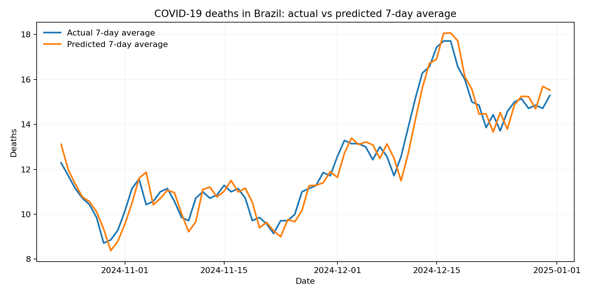
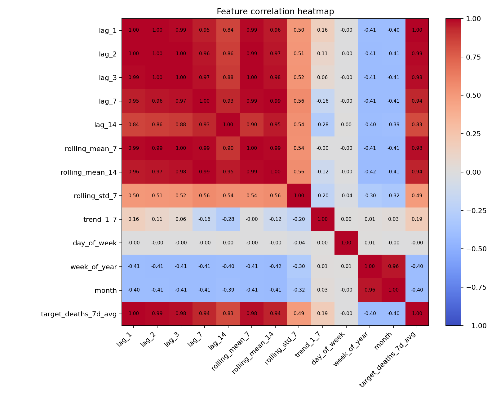

# COVID-19 Brazil Deaths Linear Regression

## PT-BR

Projeto de `machine learning` tradicional para modelar a tendência de óbitos por Covid-19 no Brasil usando `Linear Regression` e avaliação com `R²`, `MAE` e `RMSE`, a partir de dados abertos oficiais do governo federal.

O case usa microdados do `SIVEP-Gripe / SRAG`, publicados pelo Ministério da Saúde no Portal de Dados Abertos do SUS, e transforma esses registros individuais em uma série temporal nacional diária de óbitos por Covid-19 ao longo de `2024`.

## Resumo do resultado

- `Observations`: `346`
- `Train size`: `276`
- `Test size`: `70`
- `R²`: `0.9420`
- `MAE`: `0.4576`
- `RMSE`: `0.5639`

Interpretação rápida:

- o modelo explica cerca de `94.2%` da variância do alvo no conjunto de teste temporal;
- o erro absoluto médio ficou abaixo de `0.5` na escala do alvo suavizado;
- como o alvo é a `média móvel de 7 dias`, o projeto privilegia tendência epidemiológica em vez de oscilações diárias ruidosas.

## Fonte oficial dos dados

Fonte utilizada:

- Portal de Dados Abertos do SUS
- dataset: `SRAG 2019 a 2026`
- recurso oficial usado neste projeto: arquivo oficial de `2024`

Links oficiais:

- [Dataset SRAG 2019 a 2026](https://dadosabertos.saude.gov.br/dataset/srag-2019-a-2026)
- [Arquivo CSV oficial 2024](https://s3.sa-east-1.amazonaws.com/ckan.saude.gov.br/SRAG/2024/INFLUD24-26-06-2025.csv)

## Objetivo do projeto

O objetivo é construir um baseline supervisionado, reproduzível e interpretável para prever a dinâmica recente dos óbitos por Covid-19 no Brasil.

Em vez de prever diretamente a contagem bruta diária, o projeto prevê a `média móvel de 7 dias` dos óbitos diários. Isso reduz ruído de notificação, suaviza picos artificiais e torna a série mais adequada para um modelo linear baseado em lags e estatísticas móveis.

## O que é regressão linear

`Linear Regression` é um modelo supervisionado usado para prever uma variável contínua com base em uma combinação linear de variáveis explicativas.

Equação geral:

```text
y = beta_0 + beta_1 x_1 + beta_2 x_2 + ... + beta_n x_n + epsilon
```

Onde:

- `y` é o alvo a ser previsto;
- `x_1 ... x_n` são as features;
- `beta_0` é o intercepto;
- `beta_1 ... beta_n` são os coeficientes aprendidos;
- `epsilon` representa o erro residual.

Neste projeto:

- `y` é a `target_deaths_7d_avg`, isto é, a média móvel de 7 dias dos óbitos diários;
- `x` inclui lags da própria série, médias móveis, desvio padrão móvel e variáveis de calendário;
- o modelo aprende uma aproximação linear da tendência epidemiológica recente.

## Matemática por trás do modelo

Em termos matriciais, a regressão linear busca estimar:

```text
y = X beta + epsilon
```

A solução clássica minimiza a soma dos erros quadráticos:

```text
min_beta ||y - X beta||²
```

Isso significa que o algoritmo procura os coeficientes `beta` que produzem a menor diferença quadrática entre os valores observados e os valores previstos.

No contexto deste projeto:

- `X` é a matriz de features temporais;
- `y` é a série suavizada de óbitos;
- a função de custo pune mais fortemente erros grandes;
- o `R²` mede quanto da variância de `y` foi explicada por `X`.

## Por que usar regressão linear neste case

Este projeto foi desenhado como um baseline clássico e interpretável.

A regressão linear faz sentido aqui porque:

- é simples de explicar tecnicamente;
- funciona bem como baseline para séries temporais com `lag features`;
- permite conectar diretamente a modelagem com `R²`, `MAE` e `RMSE`;
- facilita mostrar engenharia de features e interpretação de tendência;
- é uma ótima primeira etapa antes de comparar com `Ridge`, `Lasso` ou modelos autoregressivos.

Ela não pretende substituir modelos temporais mais sofisticados, mas é uma escolha muito forte para um case didático com dados públicos oficiais.

## Como os dados foram construídos

Os microdados oficiais são agregados em [scripts/build_official_daily_dataset.py](./scripts/build_official_daily_dataset.py) e pela lógica equivalente em [src/data_pipeline.py](./src/data_pipeline.py).

Pipeline de agregação:

1. lê o CSV oficial do `SIVEP-Gripe / SRAG`;
2. filtra `CLASSI_FIN = 5`, correspondentes a SRAG por Covid-19;
3. filtra `EVOLUCAO = 2`, correspondentes a óbito;
4. usa `DT_EVOLUCA` como data do desfecho;
5. restringe a série ao ano de `2024`;
6. agrega os óbitos em nível nacional por dia;
7. reindexa explicitamente todo o calendário de `2024`, preenchendo dias sem ocorrência com `0`.

Resultado salvo em:

- [data/covid_brazil_daily_deaths_2024.csv](./data/covid_brazil_daily_deaths_2024.csv)

## Técnicas utilizadas

Técnicas principais do projeto:

- agregação de microdados governamentais para série temporal diária;
- `feature engineering` com lags e estatísticas móveis;
- modelagem supervisionada com `Linear Regression`;
- divisão temporal treino-teste, preservando a ordem cronológica;
- avaliação de regressão com `R²`, `MAE` e `RMSE`;
- análise visual com curva real vs prevista;
- análise exploratória com `heatmap` de correlação.

## Features do modelo

As features são criadas em [src/modeling.py](./src/modeling.py).

Features usadas:

- `lag_1`
- `lag_2`
- `lag_3`
- `lag_7`
- `lag_14`
- `rolling_mean_7`
- `rolling_mean_14`
- `rolling_std_7`
- `trend_1_7`
- `day_of_week`
- `week_of_year`
- `month`

Essas variáveis ajudam a capturar:

- dependência temporal de curto prazo;
- memória recente da série;
- tendência de subida ou queda;
- padrão semanal;
- sazonalidade de calendário.

## Métricas de avaliação

### `R²`

É a métrica principal do projeto.

```text
R² = 1 - (SS_res / SS_tot)
```

Leitura prática:

- `1.0` significa ajuste perfeito;
- valores próximos de `0` indicam baixo poder explicativo;
- valores negativos indicam desempenho pior do que prever a média.

### `MAE`

`Mean Absolute Error` mede o erro absoluto médio.

É útil porque mantém a interpretação na escala do alvo e não exagera tanto o peso de poucos erros grandes.

### `RMSE`

`Root Mean Squared Error` penaliza mais fortemente erros maiores.

É importante para avaliar estabilidade do ajuste quando há oscilações mais bruscas na série.

## Bibliotecas, ferramentas e por que foram usadas

### Bibliotecas Python

- `pandas`
  Para leitura, transformação e agregação da série temporal.
- `numpy`
  Para operações numéricas e pós-processamento das previsões.
- `scikit-learn`
  Para `LinearRegression` e métricas de avaliação.
- `matplotlib`
  Para gerar os gráficos do projeto.
- `joblib`
  Para serializar o modelo treinado.
- `unittest`
  Para o teste automatizado do pipeline.

### Ferramentas usadas

- `Python 3`
  Linguagem principal do projeto.
- `curl`
  Para reconstruir a base diretamente da fonte oficial.
- `Git / GitHub`
  Para versionamento, documentação e portfólio.

### Por que esse stack foi escolhido

Esse conjunto foi escolhido porque:

- é leve e reproduzível;
- é padrão de mercado para problemas tabulares e séries simples;
- facilita explicar cada etapa do pipeline;
- não depende de infraestrutura pesada para rodar localmente.

## Visualizações

Comparação entre série real e previsão:



Heatmap de correlação entre features e alvo:



Leitura do heatmap:

- lags e médias móveis têm alta correlação com o alvo, o que era esperado;
- isso confirma que a dinâmica recente da série carrega forte poder preditivo;
- também mostra redundância parcial entre algumas features temporais, algo comum em modelos baseados em lags.

## Estrutura do projeto

- [src/data_pipeline.py](./src/data_pipeline.py): leitura e agregação da base oficial
- [src/modeling.py](./src/modeling.py): engenharia de features, treino, métricas e visualizações
- [main.py](./main.py): execução principal
- [tests/test_pipeline.py](./tests/test_pipeline.py): teste automatizado
- [scripts/build_official_daily_dataset.py](./scripts/build_official_daily_dataset.py): reconstrução da série a partir da fonte oficial

## Como executar

```bash
cd "covid-brazil-deaths-linear-regression"
python3 -m venv .venv
source .venv/bin/activate
pip install -r requirements.txt
python3 main.py
python3 -m unittest discover -s tests -v
```

## Como reconstruir a base a partir da fonte oficial

```bash
curl -L -s "https://s3.sa-east-1.amazonaws.com/ckan.saude.gov.br/SRAG/2024/INFLUD24-26-06-2025.csv" | python3 scripts/build_official_daily_dataset.py
```

## Como adaptar para um uso mais avançado

Possíveis extensões:

1. incluir múltiplos anos da base oficial;
2. prever série semanal em vez de diária;
3. comparar com `Ridge`, `Lasso` e modelos autoregressivos;
4. incluir mais variáveis sazonais e feriados;
5. modelar a série por UF além do agregado nacional.

---

## EN

Traditional `machine learning` project that models the trend of COVID-19 deaths in Brazil using `Linear Regression` and evaluation with `R²`, `MAE`, and `RMSE`, based on official Brazilian federal open data.

The case uses `SIVEP-Gripe / SRAG` microdata published by the Ministry of Health through the SUS open data portal and transforms those individual records into a national daily time series of COVID-19 deaths across `2024`.

## Result summary

- `Observations`: `346`
- `Train size`: `276`
- `Test size`: `70`
- `R²`: `0.9420`
- `MAE`: `0.4576`
- `RMSE`: `0.5639`

Quick interpretation:

- the model explains about `94.2%` of the target variance on the temporal test split;
- the mean absolute error stayed below `0.5` on the smoothed target scale;
- because the target is the `7-day moving average`, the project emphasizes epidemiological trend rather than noisy day-level fluctuations.

## Official data source

Source used:

- SUS Open Data Portal
- dataset: `SRAG 2019 to 2026`
- official resource used in this project: `2024` official file

Official links:

- [SRAG 2019 to 2026 dataset](https://dadosabertos.saude.gov.br/dataset/srag-2019-a-2026)
- [Official 2024 CSV file](https://s3.sa-east-1.amazonaws.com/ckan.saude.gov.br/SRAG/2024/INFLUD24-26-06-2025.csv)

## Project goal

The goal is to build a supervised, reproducible, and interpretable baseline to predict the recent dynamics of COVID-19 deaths in Brazil.

Instead of predicting the raw daily count directly, the project predicts the `7-day moving average` of daily deaths. This reduces reporting noise, smooths artificial peaks, and makes the series more suitable for a linear model driven by lags and rolling statistics.

## What linear regression is

`Linear Regression` is a supervised model used to predict a continuous target based on a linear combination of explanatory variables.

General equation:

```text
y = beta_0 + beta_1 x_1 + beta_2 x_2 + ... + beta_n x_n + epsilon
```

Where:

- `y` is the target to predict;
- `x_1 ... x_n` are the features;
- `beta_0` is the intercept;
- `beta_1 ... beta_n` are the learned coefficients;
- `epsilon` is the residual error.

In this project:

- `y` is `target_deaths_7d_avg`, the 7-day moving average of daily deaths;
- `x` includes lags of the series itself, rolling statistics, and calendar variables;
- the model learns a linear approximation of the recent epidemiological trend.

## Math behind the model

In matrix form, linear regression estimates:

```text
y = X beta + epsilon
```

The classical solution minimizes the sum of squared residuals:

```text
min_beta ||y - X beta||²
```

That means the algorithm searches for the coefficients `beta` that produce the smallest squared gap between observed and predicted values.

In this project:

- `X` is the temporal feature matrix;
- `y` is the smoothed deaths series;
- the objective function penalizes larger errors more heavily;
- `R²` measures how much of the variance in `y` is explained by `X`.

## Why linear regression was used here

This project was designed as a classical, interpretable baseline.

Linear regression makes sense here because:

- it is straightforward to explain;
- it works well as a baseline for time series with lag engineering;
- it connects naturally to `R²`, `MAE`, and `RMSE`;
- it makes feature engineering and recent-trend interpretation explicit;
- it is a strong first step before comparing against `Ridge`, `Lasso`, or autoregressive models.

It is not meant to replace more sophisticated time-series models, but it is a very strong choice for an educational case based on official public data.

## How the data was built

The official microdata is aggregated in [scripts/build_official_daily_dataset.py](./scripts/build_official_daily_dataset.py) and by equivalent logic in [src/data_pipeline.py](./src/data_pipeline.py).

Aggregation flow:

1. read the official `SIVEP-Gripe / SRAG` CSV;
2. filter `CLASSI_FIN = 5`, corresponding to COVID-19 SRAG;
3. filter `EVOLUCAO = 2`, corresponding to death;
4. use `DT_EVOLUCA` as the outcome date;
5. restrict the series to `2024`;
6. aggregate deaths at the national day level;
7. explicitly reindex the full `2024` calendar, filling days without events with `0`.

Output:

- [data/covid_brazil_daily_deaths_2024.csv](./data/covid_brazil_daily_deaths_2024.csv)

## Techniques used

Core techniques:

- official government microdata aggregation into a daily time series;
- lag and rolling-statistics feature engineering;
- supervised modeling with `Linear Regression`;
- chronological train-test split;
- regression evaluation with `R²`, `MAE`, and `RMSE`;
- visual analysis with actual-vs-predicted curves;
- exploratory analysis with a correlation heatmap.

## Model features

Features are created in [src/modeling.py](./src/modeling.py).

Features used:

- `lag_1`
- `lag_2`
- `lag_3`
- `lag_7`
- `lag_14`
- `rolling_mean_7`
- `rolling_mean_14`
- `rolling_std_7`
- `trend_1_7`
- `day_of_week`
- `week_of_year`
- `month`

These variables help capture:

- short-term temporal dependence;
- recent memory of the series;
- upward or downward trend;
- weekly pattern;
- calendar seasonality.

## Evaluation metrics

### `R²`

This is the main project metric.

```text
R² = 1 - (SS_res / SS_tot)
```

Practical reading:

- `1.0` means perfect fit;
- values close to `0` indicate weak explanatory power;
- negative values mean the model performs worse than predicting the mean.

### `MAE`

`Mean Absolute Error` measures the average absolute error.

It is useful because it stays in the target scale and does not overemphasize a few large deviations.

### `RMSE`

`Root Mean Squared Error` penalizes larger errors more strongly.

It helps assess how stable the fit remains when the series shows sharper oscillations.

## Libraries, tools, and why they were used

### Python libraries

- `pandas`
  For reading, transforming, and aggregating the time series.
- `numpy`
  For numerical operations and prediction post-processing.
- `scikit-learn`
  For `LinearRegression` and regression metrics.
- `matplotlib`
  For generating project plots.
- `joblib`
  For serializing the trained model.
- `unittest`
  For automated pipeline testing.

### Tools used

- `Python 3`
  Main implementation language.
- `curl`
  To rebuild the dataset directly from the official source.
- `Git / GitHub`
  For versioning, documentation, and portfolio presentation.

### Why this stack was chosen

This stack was chosen because it is:

- lightweight and reproducible;
- standard for tabular problems and simple time-series baselines;
- easy to explain in each pipeline step;
- free from heavy infrastructure requirements for local execution.

## Visualizations

Actual vs predicted series:


Feature-target correlation heatmap:


Heatmap interpretation:

- lags and rolling means show high correlation with the target, as expected;
- this confirms that recent series dynamics carry strong predictive signal;
- it also reveals partial redundancy across some temporal features, which is common in lag-based models.

## Project structure

- [src/data_pipeline.py](./src/data_pipeline.py): official data reading and aggregation
- [src/modeling.py](./src/modeling.py): feature engineering, training, metrics, and plots
- [main.py](./main.py): main execution entry point
- [tests/test_pipeline.py](./tests/test_pipeline.py): automated test
- [scripts/build_official_daily_dataset.py](./scripts/build_official_daily_dataset.py): rebuild the daily series from the official source

## Run

```bash
cd "covid-brazil-deaths-linear-regression"
python3 -m venv .venv
source .venv/bin/activate
pip install -r requirements.txt
python3 main.py
python3 -m unittest discover -s tests -v
```

## Rebuild the dataset from the official source

```bash
curl -L -s "https://s3.sa-east-1.amazonaws.com/ckan.saude.gov.br/SRAG/2024/INFLUD24-26-06-2025.csv" | python3 scripts/build_official_daily_dataset.py
```

## How to extend the project

Possible next steps:

1. include multiple years from the official source;
2. predict weekly instead of daily series;
3. compare against `Ridge`, `Lasso`, and autoregressive models;
4. add stronger seasonal variables and holiday effects;
5. model deaths by Brazilian state in addition to the national aggregate.
