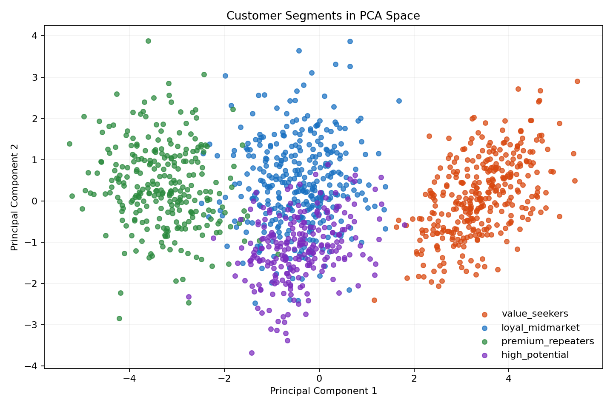

# Customer Segmentation with KNN Profiles

## PT-BR

Projeto de `machine learning` tradicional focado em encontrar clientes semelhantes usando `K-Nearest Neighbors (KNN)`. Em vez de prever uma variável alvo diretamente, este case usa distância em espaço vetorial para identificar perfis próximos, apoiar segmentação e criar uma camada simples de recomendação orientada por similaridade.

### O que é KNN

`KNN` significa `K-Nearest Neighbors`, ou `K Vizinhos Mais Próximos`.

É um algoritmo baseado em similaridade. A ideia é simples:

1. representar cada registro como um ponto em um espaço de features;
2. medir a distância entre esse ponto e os demais pontos da base;
3. recuperar os `k` exemplos mais próximos;
4. usar essa vizinhança para apoiar classificação, regressão ou busca por perfis semelhantes.

Neste projeto, o KNN não está sendo usado como classificador supervisionado tradicional. Aqui ele funciona como um mecanismo de `profile retrieval`: dado um cliente, o sistema encontra outros clientes parecidos com base na proximidade entre seus atributos.

### Objetivo do case

A ideia central é responder perguntas como:

- quais clientes são mais parecidos com este cliente?
- que perfil comportamental esse cliente tem?
- quais segmentos aparecem ao redor dele?
- como usar proximidade para apoiar marketing, CRM ou personalização?

Esse tipo de abordagem é muito útil quando o negócio quer trabalhar com `lookalike profiles`, recuperação de clientes comparáveis ou agrupamento operacional baseado em comportamento.

### Por que usar KNN aqui

`KNN` é uma técnica simples e poderosa quando a noção de semelhança entre registros faz sentido.

Neste projeto, ele foi escolhido porque:

- é intuitivo para explicar;
- funciona bem em dados tabulares normalizados;
- permite recuperar perfis reais, não apenas scores abstratos;
- é útil para CRM, recomendação e segmentação assistida.

Em vez de dizer apenas “este cliente pertence ao segmento X”, o projeto permite dizer:

“estes são os clientes historicamente mais parecidos com ele”.

### Como usar o modelo neste projeto

O fluxo de uso do KNN aqui é:

1. carregar ou gerar a base de clientes;
2. selecionar as features numéricas que definem o comportamento do cliente;
3. padronizar essas variáveis;
4. ajustar o modelo de vizinhança;
5. escolher um cliente-alvo;
6. recuperar os `k` clientes mais próximos;
7. analisar se os vizinhos pertencem ao mesmo perfil ou a perfis próximos.

Na prática, isso serve para:

- encontrar clientes comparáveis;
- criar campanhas para perfis lookalike;
- apoiar CRM e personalização;
- entender a posição de um cliente dentro do espaço de comportamento.

### Dados utilizados

O dataset é gerado de forma reproduzível em [src/data.py](./src/data.py) e salvo em [data/customer_profiles.csv](./data/customer_profiles.csv).

Cada registro representa um cliente e inclui variáveis como:

- `age`
- `annual_income`
- `purchase_frequency_monthly`
- `average_ticket`
- `digital_engagement_score`
- `return_rate_pct`
- `support_tickets_quarter`
- `loyalty_months`
- `discount_sensitivity_score`
- `web_visits_monthly`
- `app_sessions_weekly`
- `tenure_months`

Além disso, a base contém uma coluna de referência:

- `segment_label`

Ela não é usada pelo KNN como alvo supervisionado. Aqui ela funciona como uma forma de avaliar qualitativamente se os vizinhos encontrados fazem sentido em termos de proximidade de comportamento.

### Segmentos simulados

A base foi desenhada com quatro perfis sintéticos:

- `value_seekers`
- `loyal_midmarket`
- `premium_repeaters`
- `high_potential`

Esses segmentos diferem em renda, frequência de compra, ticket médio, engajamento digital, sensibilidade a desconto e tempo de relacionamento.

### Pipeline técnico

O pipeline principal está em [src/knn_profiles.py](./src/knn_profiles.py).

Fluxo implementado:

1. geração ou carregamento do dataset tabular;
2. seleção das variáveis numéricas que definem o perfil do cliente;
3. normalização com `StandardScaler`;
4. ajuste de `NearestNeighbors` com distância euclidiana;
5. recuperação dos `k` clientes mais parecidos com um cliente-alvo;
6. export de artefatos com resumo e exemplos de vizinhança.

### Matemática por trás do KNN

O KNN depende de uma noção de distância entre observações.

Neste projeto foi usada a distância euclidiana:

```text
d(x, y) = sqrt(sum((x_i - y_i)^2))
```

Ou seja, para dois clientes `x` e `y`, calculamos a diferença entre cada feature, elevamos ao quadrado, somamos tudo e tiramos a raiz quadrada.

Essa métrica funciona bem quando:

- as features são numéricas;
- a escala entre variáveis foi tratada corretamente;
- a proximidade geométrica tem significado de negócio.

Como KNN é sensível à escala, a normalização com `StandardScaler` é uma etapa essencial. Sem ela, uma variável como renda anual poderia dominar completamente a distância e distorcer a noção de similaridade.

Em resumo:

- KNN não “aprende pesos internos” como uma rede neural;
- ele aprende a estrutura espacial da base;
- a resposta depende da posição relativa de cada ponto no espaço de features.

### Bibliotecas e frameworks usados

- `pandas`
  Para manipulação dos perfis de clientes.
- `numpy`
  Para geração da base sintética.
- `scikit-learn`
  Para normalização, KNN e métrica de `silhouette`.
- `joblib`
  Para persistir o pipeline treinado.
- `unittest`
  Para validar o fluxo principal.

### Técnicas utilizadas e por quê

#### `StandardScaler`

Como KNN depende de distância, escalas diferentes entre variáveis podem distorcer a noção de proximidade.

Por exemplo:

- renda anual pode estar na casa de dezenas de milhares;
- taxa de retorno pode variar entre `0` e `18`;
- frequência de compra pode variar entre `1` e `10`.

Sem normalização, variáveis com valores maiores dominariam a distância.

#### `NearestNeighbors`

Foi usado em vez de um classificador supervisionado porque o foco aqui é:

- recuperar exemplos próximos;
- medir similaridade;
- explorar perfis;
- apoiar decisão orientada por vizinhança.

Ou seja, este projeto trata KNN como mecanismo de `profile retrieval`, não apenas como algoritmo de classificação.

#### Escolha de `k`

Neste projeto, o valor padrão é `k = 5`.

Essa escolha representa um equilíbrio simples:

- poucos vizinhos demais podem deixar a análise instável;
- muitos vizinhos podem diluir a noção de perfil local.

Em cenários reais, esse valor pode ser ajustado conforme o tamanho da base, a densidade dos grupos e o objetivo do negócio.

#### `Silhouette Score`

O `silhouette score` foi incluído como uma leitura auxiliar da separação estrutural entre os grupos simulados no espaço padronizado.

Ele não substitui análise de negócio, mas ajuda a indicar se os perfis gerados estão razoavelmente organizados em regiões diferentes do espaço de features.

### Métricas e critérios de avaliação

Como este projeto não é uma classificação supervisionada clássica, a avaliação precisa ser interpretada de forma diferente.

#### `Silhouette Score`

É a métrica principal do projeto.

Ela mede quão bem cada ponto está posicionado em relação ao seu grupo comparado aos outros grupos. Em termos intuitivos:

- valores mais altos indicam grupos mais separados;
- valores próximos de zero indicam sobreposição maior;
- valores negativos indicariam alocação ruim ou confusão estrutural.

No contexto deste projeto, o `silhouette score` ajuda a verificar se os segmentos sintéticos realmente ocupam regiões relativamente distintas do espaço vetorial.

#### Coerência dos vizinhos

Além da métrica global, existe uma avaliação qualitativa importante:

- os vizinhos mais próximos de um cliente fazem sentido?
- eles pertencem ao mesmo perfil ou a perfis compatíveis?

Esse critério é útil porque, em sistemas de similaridade, a interpretação humana da vizinhança também importa muito.

#### Variância explicada no PCA

Com a projeção em duas componentes principais, o projeto também mostra quanta variância do conjunto é preservada em 2D.

Isso não mede qualidade do KNN diretamente, mas ajuda a interpretar visualmente se a estrutura dos segmentos aparece de forma razoável na projeção.

### Saída do projeto

Ao rodar [main.py](./main.py), o projeto gera:

- [artifacts/knn_profiles.joblib](./artifacts/knn_profiles.joblib)
- [artifacts/profile_summary.json](./artifacts/profile_summary.json)
- [artifacts/neighbor_examples.csv](./artifacts/neighbor_examples.csv)

Esses artefatos guardam:

- o pipeline com `StandardScaler + NearestNeighbors`
- um resumo do dataset
- um cliente de exemplo e seus vizinhos mais próximos

### Resultado atual

Na execução atual, o projeto mostra:

- `1200` clientes
- `4` segmentos simulados
- `silhouette score` em torno de `0.198`
- `PCA explained variance`: aproximadamente `[0.5273, 0.1078]`
- vizinhos próximos coerentes com o segmento do cliente consultado

No exemplo atual, o cliente `C0001`, do grupo `premium_repeaters`, recupera vizinhos do mesmo perfil, o que indica que a estrutura sintética e a normalização estão produzindo uma noção razoável de semelhança.

### Visualização com PCA

Para facilitar a interpretação visual dos perfis, o projeto também projeta os clientes em duas componentes principais com `PCA`.

Essa visualização ajuda a:

- reduzir o espaço de features para duas dimensões;
- observar separação aproximada entre segmentos;
- entender se os grupos ocupam regiões parecidas ou distintas no espaço vetorial.



### Como executar

```bash
cd "customer-segmentation-knn"
python3 -m venv .venv
source .venv/bin/activate
pip install -r requirements.txt
python3 main.py
python3 -m unittest discover -s tests -v
```

### Como adaptar para dados reais

Para usar esse projeto em um cenário real, o caminho natural seria:

1. substituir a base sintética por dados reais de CRM ou e-commerce;
2. revisar quais features realmente representam comportamento de cliente;
3. testar diferentes métricas de distância, como `cosine` ou `manhattan`;
4. incluir filtros por canal, país ou categoria de cliente;
5. usar os vizinhos para recomendação, targeting ou recuperação de campanhas parecidas.

---

## EN

Traditional `machine learning` project focused on finding similar customers with `K-Nearest Neighbors (KNN)`. Instead of directly predicting a target variable, this case uses distance in feature space to identify close profiles, support segmentation, and build a lightweight similarity-driven recommendation layer.

### What KNN is

`KNN` stands for `K-Nearest Neighbors`.

It is a similarity-based algorithm. The core idea is:

1. represent each record as a point in feature space;
2. measure the distance between that point and the others in the dataset;
3. retrieve the `k` nearest examples;
4. use that neighborhood for classification, regression, or similarity search.

In this project, KNN is not being used as a traditional supervised classifier. Here it acts as a `profile retrieval` mechanism: given one customer, the system finds similar customers based on proximity across behavioral features.

### Use case

The core idea is to answer questions such as:

- which customers are most similar to this one?
- what behavioral profile does this customer have?
- which segments appear around this profile?
- how can proximity be used to support CRM, personalization, or marketing?

This kind of approach is useful when the business wants to work with `lookalike profiles`, comparable customer retrieval, or behavior-based operational segmentation.

### Why KNN was used here

`KNN` is a simple and powerful technique whenever similarity between records is meaningful.

It was chosen here because:

- it is intuitive to explain;
- it works well on normalized tabular data;
- it retrieves real profiles instead of only abstract scores;
- it is useful for CRM, recommendation, and assisted segmentation.

Instead of saying only “this customer belongs to segment X”, the project makes it possible to say:

“these are the historically most similar customers to this profile”.

### How the model is used in this project

The KNN workflow here is:

1. load or generate the customer dataset;
2. select the numeric features that define customer behavior;
3. standardize these variables;
4. fit the neighborhood model;
5. choose a target customer;
6. retrieve the `k` nearest customers;
7. inspect whether the neighbors belong to the same or related behavioral profile.

In practice, this supports:

- customer lookalike discovery;
- CRM and personalization;
- similarity-driven targeting;
- profile-based exploration of a customer base.

### Data

The dataset is generated reproducibly in [src/data.py](./src/data.py) and saved to [data/customer_profiles.csv](./data/customer_profiles.csv).

Each row represents a customer and includes variables such as:

- `age`
- `annual_income`
- `purchase_frequency_monthly`
- `average_ticket`
- `digital_engagement_score`
- `return_rate_pct`
- `support_tickets_quarter`
- `loyalty_months`
- `discount_sensitivity_score`
- `web_visits_monthly`
- `app_sessions_weekly`
- `tenure_months`

The dataset also includes a reference label:

- `segment_label`

It is not used as a supervised target. Here it serves as a qualitative check to verify whether the retrieved neighbors make sense in terms of behavioral similarity.

### Simulated segments

The synthetic dataset was designed around four customer profiles:

- `value_seekers`
- `loyal_midmarket`
- `premium_repeaters`
- `high_potential`

These segments differ in income, purchase frequency, average ticket, digital engagement, discount sensitivity, and relationship length.

### Technical pipeline

The main pipeline lives in [src/knn_profiles.py](./src/knn_profiles.py).

Implemented flow:

1. generate or load the tabular dataset;
2. select the numeric features that define the customer profile;
3. normalize them with `StandardScaler`;
4. fit `NearestNeighbors` using Euclidean distance;
5. retrieve the `k` most similar customers for a target customer;
6. export artifacts with summary and neighbor examples.

### The math behind KNN

KNN depends on a notion of distance between observations.

This project uses Euclidean distance:

```text
d(x, y) = sqrt(sum((x_i - y_i)^2))
```

For two customers `x` and `y`, we compute the difference between each feature, square those differences, sum them, and take the square root.

This works well when:

- the features are numeric;
- scales have been handled properly;
- geometric proximity has business meaning.

Because KNN is highly sensitive to scale, `StandardScaler` is essential. Without scaling, a feature such as annual income could dominate the distance and distort similarity.

In short:

- KNN does not learn internal weights like a neural network;
- it learns the spatial structure of the dataset;
- its output depends on how each point sits relative to the others in feature space.

### Libraries and frameworks used

- `pandas`
  For customer profile manipulation.
- `numpy`
  For synthetic data generation.
- `scikit-learn`
  For scaling, KNN, and `silhouette` evaluation.
- `joblib`
  For saving the fitted pipeline.
- `unittest`
  For validating the main workflow.

### Techniques used and why

#### `StandardScaler`

Because KNN is distance-based, different feature scales can distort similarity.

For example:

- annual income may be in the tens of thousands;
- return rate may range from `0` to `18`;
- purchase frequency may range from `1` to `10`.

Without scaling, larger-valued variables would dominate the distance computation.

#### `NearestNeighbors`

It was used instead of a supervised classifier because the main goal here is to:

- retrieve similar examples;
- measure similarity;
- explore profiles;
- support neighborhood-based decisions.

In other words, this project treats KNN as a `profile retrieval` mechanism, not only as a classification algorithm.

#### Choice of `k`

This project uses `k = 5` by default.

That is a practical balance:

- too few neighbors can make the analysis unstable;
- too many neighbors can dilute the local profile.

In real applications, `k` should be tuned according to dataset size, neighborhood density, and business objective.

#### `Silhouette Score`

The `silhouette score` was added as an auxiliary signal of structural separation between the simulated groups in scaled feature space.

It does not replace business validation, but it helps indicate whether the generated profiles are reasonably organized into distinct regions of the feature space.

### Metrics and evaluation criteria

Because this is not a standard supervised classification task, evaluation should be interpreted differently.

#### `Silhouette Score`

This is the main metric in the project.

It measures how well each point is positioned relative to its own group versus other groups. Intuitively:

- higher values indicate more separated groups;
- values near zero indicate more overlap;
- negative values would suggest poor structural separation.

In this project, the `silhouette score` helps verify whether the synthetic segments actually occupy relatively distinct regions in vector space.

#### Neighbor coherence

In addition to a global metric, there is an important qualitative check:

- do the nearest neighbors of a customer make sense?
- do they belong to the same profile or a closely related one?

This matters because, in similarity systems, the human interpretability of the neighborhood is also important.

#### PCA explained variance

With the 2D PCA projection, the project also shows how much of the original variance is preserved in two principal components.

This does not evaluate KNN directly, but it helps visually inspect whether the segment structure remains meaningful in a lower-dimensional view.

### Project outputs

Running [main.py](./main.py) generates:

- [artifacts/knn_profiles.joblib](./artifacts/knn_profiles.joblib)
- [artifacts/profile_summary.json](./artifacts/profile_summary.json)
- [artifacts/neighbor_examples.csv](./artifacts/neighbor_examples.csv)

These artifacts store:

- the fitted `StandardScaler + NearestNeighbors` pipeline
- a summary of the dataset
- one sample customer and its nearest neighbors

### Current result

In the current run, the project shows:

- `1200` customers
- `4` simulated segments
- a `silhouette score` around `0.198`
- `PCA explained variance`: approximately `[0.5273, 0.1078]`
- coherent nearest neighbors for the sample customer

In the current example, customer `C0001`, from the `premium_repeaters` group, retrieves neighbors from the same profile, which indicates that the synthetic structure and normalization are producing a reasonable notion of similarity.

### PCA visualization

To make the profile structure easier to inspect, the project also projects customers into two principal components with `PCA`.

This visualization helps:

- reduce the feature space into two dimensions;
- inspect approximate separation between segments;
- understand whether customer groups occupy similar or distinct regions in the vector space.


### Run

```bash
cd "customer-segmentation-knn"
python3 -m venv .venv
source .venv/bin/activate
pip install -r requirements.txt
python3 main.py
python3 -m unittest discover -s tests -v
```

### How to adapt it to real data

To use this project in a real-world setting, the natural path would be:

1. replace the synthetic dataset with real CRM or e-commerce data;
2. review which features truly represent customer behavior;
3. test other distance metrics, such as `cosine` or `manhattan`;
4. include filters by channel, country, or customer type;
5. use neighbors for recommendation, targeting, or campaign retrieval.
